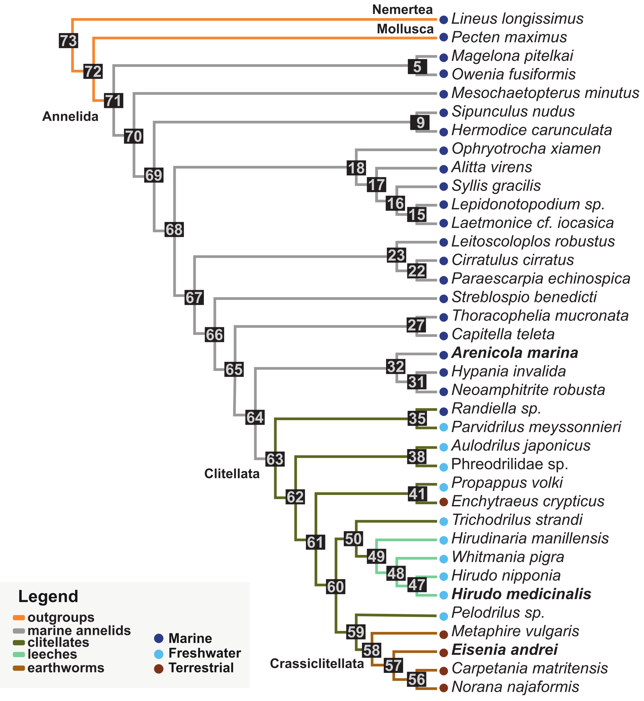

# Gene repertoire evolutionary dynamics

## 1. Description 

High quality data from thirty-five annelid species and two outgroups (Nemertea and Mollusca) was used to infer gene repertoire evolutionary dynamics across the Annelida phylum. The pipeline described in the MATEdb2 database was used to retrieve the longest isoform for each species. Hierarchical orthologous groups (HOGs) were inferred with OMA v2.682. Gene repertoire evolutionary dynamics across nodes were estimated with pyHam and curated with custom scripts following the workflow available here. Longest isoforms in protein mode were functionally annotated with  both homology-based methods (eggNOG-mapper v2) and natural language processing ones (FANTASIA). Using the Gene Ontology (GO) annotations inferred with FANTASIA, GO enrichment analysis of genes loss in each internode were calculated using the Fisher test and the elim algorithm as implemented in the topGO package. Additionally, to confirm that genes lost in Clitellata were enriched in pathways involved in genome stability, DNA repair, cell cycle and chromatin remodelling, the  genes from those HOGs present in non-clitellate species (*Sipunculus nudus*, *Streblospio benedicti*, *Paraescarpia echinospica* and *Pecten maximus* as outgroup) were retrieved for each species, gene names were extracted from the eggNOG-mapper annotations and analysed in the software Reactome (https://reactome.org/).



## 2. Commands:
Guidelines to analyze Gene Repertoire Evolution using OMA and pyHam
================

- <a href="#1-run-oma" id="toc-1-run-oma">1. Run OMA</a>
- <a href="#analyse-omas-output-with-pyham"
  id="toc-analyse-omas-output-with-pyham">2. Analyse OMA’s output with
  pyHam</a>
  - <a
    href="#21-run-pyham-to-obtain-top-hogs-ancestral-genomes-and-sequences-by-hog"
    id="toc-21-run-pyham-to-obtain-top-hogs-ancestral-genomes-and-sequences-by-hog">2.1.
    Run pyHam to obtain top HOGs, ancestral genomes, and sequences by
    HOG</a>
  - <a href="#22-obtain-species-composition-and-counts-tables"
    id="toc-22-obtain-species-composition-and-counts-tables">2.2. Obtain
    species composition and counts tables</a>
  - <a href="#23-filter-hogs" id="toc-23-filter-hogs">2.3. Filter HOGs</a>
- <a
  href="#3-filter-and-curate-gene-repertoire-evolution-from-pyham-output"
  id="toc-3-filter-and-curate-gene-repertoire-evolution-from-pyham-output">3.
  Filter and curate Gene Repertoire Evolution from pyHam output</a>
- <a href="#4-enrichment-analyses" id="toc-4-enrichment-analyses">4.
  Enrichment analyses</a>
  - <a href="#41-hogs-annotation" id="toc-41-hogs-annotation">4.1. HOGs
    annotation</a>
  - <a href="#42-do-enrichment" id="toc-42-do-enrichment">4.2. Do
    enrichment</a>
- <a href="#5-capturing-differential-expressed-genes-in-omas-analysis"
  id="toc-5-capturing-differential-expressed-genes-in-omas-analysis">5.
  Capturing differential expressed genes in OMA’s analysis</a>
- <a href="#6-follow-hog-history" id="toc-6-follow-hog-history">6. Follow
  HOG history</a>
- <a href="#acknowledgments" id="toc-acknowledgments">Acknowledgments</a>

This workflow infer gene repertoire dynamics across a species tree using
the hierarchical orthogroups (HOGs) inferred by OMA ([Altenhoff et al
2019](http://www.genome.org/cgi/doi/10.1101/gr.243212.118)). The HOGs
are defined as a set of genes that have descended from a single common
ancestor within a taxonomic range of interest ([Altenhoff et al
2013](https://doi.org/10.1371/journal.pone.0053786)).

The information about these HOGs is stored in the
HierarchicalGroups.orthoxml file, one of the outputs of OMA. This file,
along the species tree are analysed with pyHam ([Train et al
2018](https://doi.org/10.1093/bioinformatics/bty994)) to identify the
origin of HOGs (gains by node) and to obtain a first approximation of
gene repertoire evolution (GRE). Eventually, this data is filtered and
curated with custom scripts. All of them available here.

Here, we describe the full workflow followed to annotate and analyse the
gene repertoire evolution in the context of the scientific questions
raised in **Vargas-Chávez et al 2024**, describing the chromosome
rearrangements involved in clitellates evolution.

**NOTE:** you can find example files in the Examples folder and all the
scripts in the Scripts folder

### 1. Run OMA

Please, refer to the [OMA’s user
guide](https://omabrowser.org/standalone/) for more information about
OMA standalone installation and run options.

To start the analysis you have to create a folder called DB where are
located the pep files (with extension .fa, what does OMA like). Here we
analyze data from 37 species, corresponding to 35 annelids and 2
outgroups (LLON and PMAX). Please, be aware of the name of the files.
For a better performance in the next steps, we recommend to use an
acronym of 4 letter to identify every species. Please use the same
acronym to name the pep file and use the acronym followed of a dot to
identify the sequences.

Examples:  
grep “\>” EAND.fa \| head -n3  
\>EAND.evm.TU.Chr01.1  
\>EAND.evm.TU.Chr01.2  
\>EAND.evm.TU.Chr01.3  
grep “\>” COCO2.fa \| head -n3  
\>COCO2.DN26371_c0_g1_i8.p1  
\>COCO2.DN92013_c0_g1_i1.p1  
\>COCO2.DN24276_c0_g3_i1.p1

Additionally, you have to prepare the file: parameters.drw with the
options that you decide following the objective of your analysis and
your questions.

The following scripts are designed to send jobs to a cluster with slurm
system: please, feel free to modify them to suit your needs.

To run OMA’s first stage in parallel mode, run the following script:

**1.1.oma_1st.sh**

``` bash
#!/bin/sh

#SBATCH -N 1
#SBATCH -C clk
#SBATCH --mem=2G
#SBATCH --array=1-60
#SBATCH -o OMA_1st.%A_%a.out
#SBATCH -e OMA_1st.%A_%a.err
#SBATCH --time=7-00:00:00
#SBATCH --mail-type=ALL
#SBATCH --mail-user="mail@.com"

export NR_PROCESSES=60

#Running all-versus-all 1st stage
echo "**************" Running OMA first stage "************"
OMA -s
echo "***************" First stage OMA done "***************"
```

This step is vary time consuming. Please, use the array option to
parallelize this job.

**To add species or replace wrong files in previous runs:**

From OMA’s documentation:  
” Adding/Updating new genomes  
It is possible to add new genomes without recomputing the
all-against-all phase for pre-existing genomes. To do so, simply add the
new fasta databases in the DB/ directory and re-run OMA. Likewise, **it
is possible to update a genome by deleting the old genome from the DB/
directory, and adding a new file. Important: to avoid clashes with
previously computed results, the updated genome must use a different
filename than any previously computed result**.”

Please, remember to update the species tree in the parameters.drw file
if you add new species or replace fasta files with a new name.
Additionally, remember to keep the same name in the fasta files, in the
species tree and in the name of the sequences.

If you need to add new files, please run OMA with the -c option, before
re-starting the previous step:

**1.1.1.oma_db.sh**

``` bash
#!/bin/sh

#SBATCH -N 1
#SBATCH -C clk
#SBATCH --mem=2G
#SBATCH -o OMA_expanded_db.%A_%a.out
#SBATCH -e OMA_expanded_db.%A_%a.err
#SBATCH --time=2-00:00:00
#SBATCH --mail-type=ALL
#SBATCH --mail-user="mail@.com"


#Running db single process
echo "***************" Running OMA first stage "***************"
OMA -c
echo "***************" db process OMA done "***************"
```

When the first stage (all vs all) finish, you have to launch the second
stage. Please it is essential to use the version 2.6 of OMA to run this
stage. For that, run the script:

**1.2.oma_2nd.sh**

``` bash
#!/bin/sh

#SBATCH -N 1
#SBATCH -c 1
#SBATCH -C clk
#SBATCH --mem=100G
#SBATCH -o OMA-2.%A_%a.out
#SBATCH -e OMA-2.%A_%a.err
#SBATCH --time=0-72:00:00
#SBATCH --mail-type=ALL
#SBATCH --mail-user="mail@com"

#Check version
echo checking OMA version
OMA -v
echo "***************************************************************************"

#Running OMA V>=2.6
OMA
```

### 2. Analyse OMA’s output with pyHam

You can find the output of this analysis in the Output folder (check
name and date to be sure that it is the correct one). From this folder,
copy to your local computer the files: HierarchicalGroups.orthoxml and
ManualSpeciesTree.nwk.

**Annotate the species tree**

Please, annotate the nodes of this tree. We recommend to use the same
annotation that OMA assigned, so the identification of the gained HOGs
by node will be easier. To know the annotation of OMA, you can run the
following commands:

``` bash
grep "species name" HierarchicalGroups.orthoxml > Leaves_taxonID.txt
grep -B1 "TaxRange" HierarchicalGroups.orthoxml | sed 's/id=.*//' | tr '\n' '@' | sed 's/>@/%/g'| tr '%' '\n' | tr -d ' ' | sort | uniq > Group_taxonID.txt
```

From these files you can extract the annotation of the leaves and the
nodes and annotate the nodes of the species tree with the same
numbering. See example file (SpeciesTree_nodes.nwk) in EXAMPLES folder.

**Install pyHam**

Please read [pyHam’s
documentation](https://github.com/DessimozLab/pyham) and visit the
following pages for more information:

<http://lab.dessimoz.org/blog/2017/06/29/pyham>  
<https://zoo.cs.ucl.ac.uk/tutorials/tutorial_pyHam_get_started.html>  
<https://github.com/DessimozLab/pyham>

``` bash
python -m venv /path/to/pyham_env # create a new environment and install pyHam and others libraries that you will need
source  /path/to/pyham_env/bin/activate
python -m pip install --upgrade pip
pip install pyham
pip install ete3
pip install pathlib
pip install pandas
```

#### 2.1. Run pyHam to obtain top HOGs, ancestral genomes, and sequences by HOG

Use the script 2.1.run_pyham_annelida_full.py to obtain the ancestral
genomes by node and the sequences id by HOG and hogs.

**2.1.run_pyham.py**

``` python
{python}
'''
2.1.run_pyham.py
script to analyse OMA's output with pyHam
wrote by Lisandra Benítez Álvarez on July 2023 at Metazoa Phylogenomics Lab, Institute of Evolutionary Biology (IBE-UPF), CSIC
'''
import pyham
import csv
import re
import xml.etree.ElementTree as ET
import sys
import os
import argparse
import os
import shutil

if __name__ == "__main__":
    parser = argparse.ArgumentParser(description="Obtain ancestral genomes from OMA's HOGs using pyHam")
    parser.add_argument("-x", type=str, help="HierarchicalGroups.orthoxml", required=True)
    parser.add_argument("-t", type=str, help="species tree with node annotation in nwk format", required=True)
    parser.add_argument("-n", type=str, help="list of nodes to obtain the ancestral genomes. One node by line matching the annotation in the species tree, required=True)
    parser.add_argument("-o", type=str, help="output dir")
    args = parser.parse_args()

    #Function to save results. Save the results just as is shown in the screen with print
    def save_data(filename, result):                    
        with open(filename, "w+") as output_file:
            print(result, file=output_file)

    #Create output dir 
    out_dir = args.o
    if os.path.exists(out_dir):
        shutil.rmtree(out_dir)
    os.makedirs(out_dir)

    #Import HOGs in orthoxml format
    HOG_xml_path=args.x

    #Import tree in nwk format
    tree_path=args.t
    tree_str = pyham.utils.get_newick_string(tree_path, type="nwk")
    print("species tree loaded")
    print(tree_str)

    #Import node list
    node_list_path = args.n

    #Create pyHam object
    ham_analysis = pyham.Ham(tree_str, HOG_xml_path, use_internal_name=True)
    print("ham_analysis object created")

    # Obtain TREEPROFILE
    treeprofile = ham_analysis.create_tree_profile(outfile = out_dir + "/treeprofile.html")
    print("treeprofile saved")

    #Print TreeMap
    myTreeMap = ham_analysis.taxonomy.tree.copy(method="newick")
    print("TreeMap visualization")
    print(myTreeMap)

    # Print node names 
    print("Ancestral genomes name using newick names:")
    for ag in ham_analysis.taxonomy.internal_nodes:
        print("\t- {}".format(ag.name))

    #Get all HOGs
    top_hogs = ham_analysis.top_level_hogs
    #print(top_hogs)
    print("Number of HOGs in the input data")
    print(len(top_hogs))
    save_data(filename = out_dir + "/top_hogs_pyham.txt", result=top_hogs)

    top_hogs_list = list(top_hogs.keys())
    top_hogs_list = [key.replace(":", "") for key in top_hogs_list]
    with open(out_dir + "/top_hogs_list.txt" , 'w') as file:
        for hog in top_hogs_list:
            file.write(hog + '\n')
    
    # Get the ancestral genomes of interest
    with open(args.n, "r") as file:
        node_list = [line.strip() for line in file]

    for node in node_list:
        print(node)

        anc_node = ham_analysis.get_ancestral_genome_by_name(node)
        print("Number of genes at ancestral genome in " + node)
        print(anc_node.get_number_genes())
        anc_node_genes = anc_node.genes
        save_data(filename= out_dir + "/" + node + "_ancestral.txt", result=anc_node_genes)

    #Decomposing orthoxml into species composition lists
    #Parsing orthoxml dat
    prefix = "{http://orthoXML.org/2011/}"
    tree = ET.parse(HOG_xml_path)
    root = tree.getroot()
    ortho_data = {}

    #Save a file by hog with sequence composition
    dir = out_dir + "/HOG_seq_comp_lists"
    os.makedirs(dir)
    for ortho_group in root.findall(f".//{prefix}orthologGroup"):
        group_id = ortho_group.get("id")
        name = group_id.replace(":", "")
        with open(f"{dir}/{name}_seqs.txt", "w+") as output_file:
            for gene in ortho_group.findall(f".//{prefix}geneRef"):
                gene_id = gene.get("id")
                gene_id_to_find = gene_id
                gene = root.find(".//{http://orthoXML.org/2011/}gene[@id='" + gene_id_to_find + "']")
                prot_id = gene.get("protId")
                print(prot_id, file=output_file)
                
```

**Approximate run time:** 24-48h. Here, the most time consuming step is
the last one, creating a folder **HOG_seq_comp_lists** with a list of
sequences by HOG (top HOGs) and hog (descendants hogs). This step is
very important because several downstream scripts will run on this data.

#### 2.2. Obtain species composition and counts tables

Go to HOG_seq_comp_lists (in the output folder from the previous step)
and create two folders. Move the HOGs to one folder and the hogs to
other folder using the top_hogs_list.txt

``` bash
mkdir HOGs_gained_by_node
mkdir hogs_descendants
while read -r LINE; do mv HOG_seq_comp_lists/${LINE}* HOGs_gained_by_node/; done < top_hogs_list.txt
mv HOG_seq_comp_lists/* hogs_descendants
```

Use the following scripts to obtain the sequences composition and count
tables from the sequences composition list by HOG in HOGs_gained_by_node
and hogs_descendants folders:

**2.2.sp_comp_table_from_pyham_output.py**

``` python
'''
2.2.sp_comp_table_from_pyham_output.py
script to obtain species composition table by HOG from OMA and pyHam outputs
wrote by Lisandra Benítez Álvarez on July 2023 at Metazoa Phylogenomics Lab, Institute of Evolutionary Biology, Catalonia, Spain
'''
import os
import pandas as pd
import argparse

if __name__ == "__main__":
    parser = argparse.ArgumentParser(description='Obtain sequences composition table from sequence composition files')
    parser.add_argument('-d', type=str, help='path to directory ')
    parser.add_argument('-o', type=str, help='output file')
    args = parser.parse_args()

    # Function to process a single list file
    def process_list_file(file_path):
        with open(file_path, 'r') as file:
            lines = file.readlines()
        
        names = {}
        for line in lines:
            #parts = line.strip().split('_') las seqs de Carlos tienen otro formato en el nombre
            parts = line.strip().split('.')
            if len(parts) > 1:
                name = parts[0]
                value = line.strip()
                if name in names:
                    names[name].append(value)
                else:
                    names[name] = [value]
        
        return names

    # Directory containing the list files
    directory = args.d

    # Get a list of all text files in the directory
    file_names = [file for file in os.listdir(directory) if file.endswith('.txt')]
    
    # Process each list file
    table = {}
    for file_name in file_names:
        file_path = os.path.join(directory, file_name)
        names = process_list_file(file_path)
        table[file_name] = names
    
    df = pd.DataFrame(table).T
    df.index.name = 'name'
    df.fillna('-', inplace=True)
    df.index = df.index.str.replace('_seqs.txt', '', regex=True)
    
    def process_cell(cell):
        if cell == '-':
            return '-'
        return ', '.join(item.strip('[]') for item in cell)

    df2 = df.applymap(process_cell)
    
    # Write the table to a TSV file
    output_file = args.o
    df2.to_csv(output_file, sep='\t', index=True)

    print(f"Output table saved to {output_file}")
```

**2.2.count_table_from_pyham_output.py**

``` python
'''
2.2.count_table_from_pyham_output.py
script to obtain count table by HOG from OMA and pyHam outputs
wrote by Lisandra Benítez Álvarez on July 2023 at Metazoa Phylogenomics Lab, Institute of Evolutionary Biology, Catalonia, Spain
'''
import os
from collections import Counter
import argparse

if __name__ == "__main__":
    parser = argparse.ArgumentParser(description='Obtain sequences count table from sequence composition files')
    parser.add_argument('-d', type=str, help='path to directory ')
    parser.add_argument('-o', type=str, help='output file')
    args = parser.parse_args()

    # Directory containing the txt files
    directory = args.d

    # Get a list of txt files in the directory
    txt_files = [filename for filename in os.listdir(directory) if filename.endswith('.txt')]

    # Initialize a dictionary to store count tables for each file
    count_tables = {}

    # Loop through each txt file
    for filename in txt_files:
        file_path = os.path.join(directory, filename)
        
        # Read the contents of the txt file
        with open(file_path, 'r') as file:
            elements = file.read().splitlines()
            elements = [item.split('.')[0] for item in elements]
        
        # Create a count table for the current file
        count_table = Counter(elements)
        count_tables[filename] = count_table

    # Get the unique elements across all files
    all_elements = set()
    for count_table in count_tables.values():
        all_elements.update(count_table.keys())
    unique_elements = sorted(all_elements)

    # Print the header row
    header_row = ['HOG'] + unique_elements

    # Print the count tables for each file
    for filename, count_table in count_tables.items():
        name = filename.replace("_seqs.txt", "")
        count_row = [name] + [str(count_table.get(element, 0)) for element in unique_elements]

    # Create and write the output to a TSV file
    output_file = args.o
    with open(output_file, 'w') as outfile:
        header_row = ['HOG'] + unique_elements
        outfile.write('\t'.join(header_row) + '\n')
        
        for filename, count_table in count_tables.items():
            name = filename.replace("_seqs.txt", "")
            count_row = [name] + [str(count_table.get(element, 0)) for element in unique_elements]
            outfile.write('\t'.join(count_row) + '\n')

    print(f"Count table saved to '{output_file}'.")
```

#### 2.3. Filter HOGs

It is recommended to filter the HOGs based on the completeness score of
species representation. For that you can use the following script, with
a recommended score value equal to 0.2. Before, you have to generate a
list of species by node. See example file (species_by_node.csv) in
EXAMPLES folder.

**2.3.filtering_HOGs_by_CompletenessScore.py**

``` python
'''
2.3.filtering_HOGs_by_CompletenessScore.py
script to filter HOGs from OMA's output
wrote by Lisandra Benítez Álvarez on July 2023 at Metazoa Phylogenomics Lab, Institute of Evolutionary Biology, Catalonia, Spain
'''
import os
import pandas as pd
from collections import Counter
import argparse

if __name__ == "__main__":
    parser = argparse.ArgumentParser(description='Filtering HOGs by Completeness Score')
    parser.add_argument('-d', type=str, help='path to directory with sequences lists')
    parser.add_argument('-l', type=str, help='list of species by node')
    parser.add_argument('-c', type=str, help='cut-off for filtering as float Ex. 0.2')
    args = parser.parse_args()

    # Directory containing the sequences files
    directory = args.d

    #List of species by node
    list = args.l
    #Import list as dataframe
    df_list = pd.read_csv(list, delimiter= '\t', index_col = "node")

    #Cut-off
    cutoff = args.c
    cutoff = float(cutoff)

    # Get a list of txt files in the directory
    seqs_files = [filename for filename in os.listdir(directory) if filename.endswith('.txt')]

    # Loop through each txt file
    for filename in seqs_files:
        file_path = os.path.join(directory, filename)
        HOG = filename.replace("_seqs.txt", "")
        node = filename.split('_')[1]
        node = int(node)
        sp_node = df_list.loc[node]['species']
        sp_node = int(sp_node)
        score = sp_node * cutoff
        score = int(score)

        # Read the contents of the txt file
        with open(file_path, 'r') as file:
            elements = file.read().splitlines()
            elements = [item.split('_')[0] for item in elements]
            count_by_sp = Counter(elements)
            total_count = len(count_by_sp)
            if total_count > score:
                print(HOG, 'has passed the filtering.', HOG, 'has been saved in retained_HOGs.txt')
                with open('retained_HOGs.txt', 'a') as ret:
                    ret.write(HOG + '\n')
                    ret.close()
            else:
                print(HOG, 'has not passed the filtering.', HOG, 'has been saved in discarted_HOGs.txt')
                with open('discarted_HOGs.txt', 'a') as dis:
                    dis.write(HOG + '\n')
                    dis.close()

with open('retained_HOGs.txt', 'r') as file:
    HOGs_count = len(file.read().splitlines())
    print(HOGs_count, 'HOGs have been retained after filtering')

with open('discarted_HOGs.txt', 'r') as file:
    HOGs_count = len(file.read().splitlines())
    print(HOGs_count, 'HOGs have been discarted after filtering')
    
```

From this script you obtain the list retained_HOGs.txt with the id of
the retained HOGs after filtering. Then you can create a folder and move
the sequences files of the filtered HOGs in. From here, it is advisable
to work with filtered HOGs. Additionally, you can generate species
composition and count tables from these filtered HOGs and use them in
downstream analyses.

### 3. Filter and curate Gene Repertoire Evolution from pyHam output

You can extract the gene repertoire evolution by node using the
following script. Notice that to use this script you need:

1\) the ancestral genome of the node of interest  
2) the ancestral genome of the parental node of your node of interest  
3) the top_hog_pyham.txt file  
4) the TAXON id (by OMA) of your node of interest  
5) the TAXON id (by OMA) of the parental node of your node of interest

You obtain the files 1, 2, and 3 in the output of [2.1. Run pyHam to
obtain top HOGs, ancestral genomes, and sequences by
HOG](#21-run-pyham-to-obtain-top-hogs-ancestral-genomes-and-sequences-by-hog).
To obtain the id of the taxa, you can run the following commands and
identify the ids that OMA internally assigned to terminals and nodes in
the species tree.

``` bash
grep "species name" HierarchicalGroups.orthoxml > Leaves_taxonID.txt
grep -B1 "TaxRange" HierarchicalGroups.orthoxml | sed 's/id=.*//' | tr '\n' '@' | sed 's/>@/%/g'| tr '%' '\n' | tr -d ' ' | sort | uniq > Group_taxonID.txt
```

You can resume the info of points 4 and 5 in a table and run the script
automatically for several nodes. See example file
(File_to_run_GRE_automatic.csv) in the EXAMPLES folder.

**3.1.extract_GRE_from_pyHam.sh**

``` bash
#!/bin/sh

# 3.1.extract_GRE_from_pyHam.sh
# script to obtain the first aproximation of the GRE from pyHam outputs
# wrote by Lisandra Benítez Álvarez on July 2023 at Metazoa Phylogenomics Lab, Institute of Evolutionary Biology, Catalonia, Spain

NODE_LIST=$1 # File to run GRE automatically. See file in EXAMPLE folder
TOP_HOG=$2 #Top hog list top_hog_pyham.txt
ANC_DIR=$3 #Directory containing ancestral genomes from pyHam

while read -r LINE
do
    NODE=$(echo $LINE | cut -d " " -f1) #Node to analyze
    MY_GENOME=$(echo $LINE | cut -d " " -f2)        #Ancestral genome of interest obtained from pyHam 
    PARENTAL_GENOME=$(echo $LINE | cut -d " " -f3)  #Parental genome obtained from pyHam
    TAXON=$(echo $LINE | cut -d " " -f4) #Taxon id of interest node         
    TAXONP=$(echo $LINE | cut -d " " -f5) #Taxon id parent node
    OUT_DIR=${NODE}_node_GRE

    mkdir $OUT_DIR

    echo "*************************************************"  > $OUT_DIR/report.txt
    echo "********** GENE REPERTORIE EVOLUTION ************" >> $OUT_DIR/report.txt
    echo "*************************************************" >> $OUT_DIR/report.txt 

    echo "Total length of the ancestral genome"              >> $OUT_DIR/report.txt
    T_len=$(cat $ANC_DIR/$MY_GENOME | tr ',' '\n' | wc -l)
    echo $T_len                                              >> $OUT_DIR/report.txt
    echo "*************************************************" >> $OUT_DIR/report.txt

    echo "Identified HOGs in the ancestral genome"           >> $OUT_DIR/report.txt
    LEN=$(cat $ANC_DIR/$MY_GENOME | tr ',' '\n' | grep -v "<HOG()>" | wc -l) 
    echo $LEN                                                >> $OUT_DIR/report.txt
    echo "*************************************************" >> $OUT_DIR/report.txt

    echo "Gained HOGs in the ancestral genome"               >> $OUT_DIR/report.txt
    GAIN=$(cat $TOP_HOG | tr ',' '\n' | grep "_$TAXON" | cut -d " " -f3 | sed 's/<HOG(//;s/)>//' | wc -l)
    echo $GAIN                                               >> $OUT_DIR/report.txt 
    cat $TOP_HOG | tr ',' '\n' | grep "_$TAXON" | cut -d " " -f3 | sed "s/<HOG(//;s/_$TAXON)>//" > $OUT_DIR/GAINED_HOGs.txt
    echo "*************************************************" >> $OUT_DIR/report.txt

    echo "Total duplications events in the ancestral genome" >> $OUT_DIR/report.txt
    DUP_ev=$(cat $ANC_DIR/$MY_GENOME | grep -oE "<HOG\(HOG:[0-9]+(\.[0-9a-z]+)+_$TAXON)>" | sed 's/<HOG(//;s/)>//' | wc -l)
    echo $DUP_ev                                             >> $OUT_DIR/report.txt
    echo "Total duplicated HOGs in the ancestral genome"     >> $OUT_DIR/report.txt
    DUP=$(cat $ANC_DIR/$MY_GENOME | grep -oE "<HOG\(HOG:[0-9]+(\.[0-9a-z]+)+_$TAXON)>" | sed 's/<HOG(//;s/)>//' | cut -d "." -f1 | sort | uniq | wc -l)
    echo $DUP                                                >> $OUT_DIR/report.txt
    cat $ANC_DIR/$MY_GENOME | grep -oE "<HOG\(HOG:[0-9]+(\.[0-9a-z]+)+_$TAXON)>" | sed 's/<HOG(//;s/)>//' | cut -d "." -f1 | sort | uniq > $OUT_DIR/DUPLICATED_HOGs.txt
    echo "*************************************************" >> $OUT_DIR/report.txt

    echo "Retained HOGs in the ancestral genome"             >> $OUT_DIR/report.txt
    RET=$(cat $ANC_DIR/$MY_GENOME | tr ',' '\n' | grep -v "<HOG()>" | grep -v -f $OUT_DIR/GAINED_HOGs.txt | sed 's/<HOG(//;s/)>//' | sed "s/_$TAXON//" | cut -d "." -f1 | sort | uniq | wc -l)
    echo $RET                                                >> $OUT_DIR/report.txt
    cat $ANC_DIR/$MY_GENOME | tr ',' '\n' | grep -v "<HOG()>" | grep -v -f $OUT_DIR/GAINED_HOGs.txt | sed 's/<HOG(//;s/)>//' | sed "s/_$TAXON//" | cut -d "." -f1 | sort | uniq | sed 's/^ *//' > $OUT_DIR/RETAINED_HOGs.txt
    echo "*************************************************" >> $OUT_DIR/report.txt

    echo "Calculating gene lost from parent node"            >> $OUT_DIR/report.txt
    echo "Total length of the parent genome"                 >> $OUT_DIR/report.txt
    T_lenP=$(cat $ANC_DIR/$PARENTAL_GENOME | tr ',' '\n' | wc -l)
    echo $T_lenP                                             >> $OUT_DIR/report.txt
    echo "Identified HOGs in the parent genome"              >> $OUT_DIR/report.txt
    LENP=$(cat $ANC_DIR/$PARENTAL_GENOME | tr ',' '\n' | grep -v "<HOG()>" | wc -l)
    echo $LENP                                               >> $OUT_DIR/report.txt
    echo "*************************************************" >> $OUT_DIR/report.txt

    echo "Lost genes in the ancestral genome respect to the parent node" >> $OUT_DIR/report.txt
    echo "Lost HOGs"                                                     >> $OUT_DIR/report.txt
    LOST=$(cat $ANC_DIR/$PARENTAL_GENOME | tr ',' '\n' | grep -v "<HOG()>" | grep -v -f $OUT_DIR/RETAINED_HOGs.txt | sed "s/_$TAXONP)>//" | cut -d "." -f 1 | sort | uniq | cut -d "(" -f2 | wc -l)
    echo $LOST                                                           >> $OUT_DIR/report.txt
    cat $ANC_DIR/$PARENTAL_GENOME | tr ',' '\n' | grep -v "<HOG()>" | grep -v -f $OUT_DIR/RETAINED_HOGs.txt | sed "s/_$TAXONP)>//" | cut -d "." -f 1 | sort | uniq | cut -d "(" -f2 > $OUT_DIR/LOST_par_to_anc_HOGs.txt

done < $NODE_LIST#!/bin/sh
```

With this script you obtained the first approximation of the GRE by
node. However, these sets have to be filtered and curated. Here, we used
different cut-off that were previously tested in our dataset. Please,
adjust your cutt-off to your dataset. Run the following scripts (from
the directory containing folders of GRE by node calculated previously)
to filter and curate the sets of gained, lost, retained, duplicated, and
expanded HOGs by node.

**3.2.extract_filtered_GRE.sh**

``` bash
#!/bin/bash

# 3.2.extract_filtered_GRE.sh
# script to obtain the filtered GRE from pyHam outputs
# wrote by Lisandra Benítez Álvarez on July 2023 at Metazoa Phylogenomics Lab, Institute of Evolutionary Biology, Catalonia, Spain

RET=$1 #list of retained HOGs after filtering

for FOLDER in *_node_GRE
do
    cd $FOLDER
    for file in *_HOGs.txt
    do
        sed -i 's/HOG:/HOG/' $file
        grep -f $file ../$RET > ${file%%.txt}"_filtered.txt"
    done
    cd ..
done
```

**3.3.recover_HOGs_from_lost.py**

``` python
'''
3.3.recover_HOGs_from_lost.py
script to recoverer HOGs that are not lost in a minimum of species by node
wrote by Lisandra Benítez Álvarez on February 2024 at Metazoa Phylogenomics Lab, Institute of Evolutionary Biology, Catalonia, Spain
'''
from itertools import count
import os
import pandas as pd
from collections import Counter
import argparse
import re
import glob

if __name__ == "__main__":
    parser = argparse.ArgumentParser(description='Selecting duplicated and expanded hogs in an specific node')
    parser.add_argument('-q', type=str, help='path to directory with sequences lists')
    parser.add_argument('-d', type=str, help='list of LOST HOGs in the node (obtained from gene_rep_evol_at_hand.sh)')
    parser.add_argument('-l', type=str, help='list of species in the node')
    parser.add_argument('-p', type=float, help='cut-off for species number. float value') # use integer value if you want set the cutoff to a specific number of species
    parser.add_argument('-s', type=str, help='cut-off for sequences number. Integer value')
    parser.add_argument('-o', type=str, help='output file') #output file for recovered HOGs from LOST. THESE HOGS ARE NOT LOST!!!
    args = parser.parse_args()

    # Directory containing the sequences files
    directory = args.q

    #Set list of lost HOGs
    with open(args.d, 'r') as file:
    # Create an empty list to store the lines
        losses = []
        # Iterate over the lines of the file
        for line in file:
        # Remove the newline character at the end of the line
            lost = line.strip()
            # Append the line to the list
            losses.append(lost)

    #Set list of species
    with open(args.l, 'r') as file:
    # Create an empty list to store the lines
        species = []
        # Iterate over the lines of the file
        for line in file:
        # Remove the newline character at the end of the line
            specie = line.strip()
            # Append the line to the list
            species.append(specie)
    spnumber = len(species)

    #Cut-off
    if args.p.is_integer():
        cutoff_sp = int(args.p)
    else:
        cutoff_sp = int(spnumber * float(args.p))
    print('this is the sp cutoff: ' + str(cutoff_sp))
    cutoff_seq = int(args.s)
    print('this is the seq cutoff: ' + str(cutoff_seq))
    
    for HOG in losses:
        #Obtain sequence file
        seqs_file = os.path.join(directory, HOG + '_seqs.txt')
        #Read the contents of the txt file
        with open(seqs_file, 'r') as file:
            elements = file.read().splitlines()
            elements = [item.split('.')[0] for item in elements]
            count_by_sp = Counter(elements)
            selected_elements = {element: count for element, count in count_by_sp.items() if count >= cutoff_seq and element in species}
            if len(selected_elements) >= cutoff_sp:
                with open(args.o, 'a') as ret:
                    ret.write(HOG + '\n')
                    ret.close()

if os.path.exists(args.o):
    with open(args.o, 'r') as file:
        HOGs_count = len(file.read().splitlines())
        print(HOGs_count, 'HOGs are not lost. These HOGs have at least', cutoff_seq, 'sequences in minimum', cutoff_sp, 'species of', spnumber, 'species included in the clade')
else:
    print('upsss!! there is no recovered lost genes in this node')
    
```

**3.3.launch_recover_HOGs_from_lost.sh**

``` bash
#!/bin/bash

# 3.3.launch_recover_HOGs_from_lost.sh
# script to launch 3.3.recover_HOGs_from_lost.py script in several folders
# wrote by Lisandra Benítez Álvarez on February 2024 at Metazoa Phylogenomics Lab, Institute of Evolutionary Biology, Catalonia, Spain

SCRIPT=$1 #path to script 3.3.recover_HOGs_from_lost.py
HOGS_SEQs=$2 #path to folder with sequences by HOG

for FOLDER in *_node_GRE
do
    echo "************************" $FOLDER "*********************"
    cd $FOLDER

    python3 ../$SCRIPT -q ../$HOGS_SEQs -d=LOST_par_to_anc_HOGs_filtered.txt -l=species_by_node.txt -p 0.2 -s 1 -o=recovered_from_LOST_par_to_anc_HOGs_filtered.txt
    grep -v -f recovered_from_LOST_par_to_anc_HOGs_filtered.txt LOST_par_to_anc_HOGs_filtered.txt > REAL_LOST_filtered.txt
    cat RETAINED_HOGs_filtered.txt recovered_from_LOST_par_to_anc_HOGs_filtered.txt >> REAL_RETAINED_HOGs_filtered.txt

    echo HOGs recovered from previous LOST
    wc -l recovered_from_LOST_par_to_anc_HOGs_filtered.txt

    echo new LOST after recover
    wc -l REAL_LOST_filtered.txt

    echo new RETAINED after recover
    wc -l REAL_RETAINED_HOGs_filtered.txt

    cd ..
done
```

**3.4.sel_duplicated_and_expanded_HOGs.py**

``` python
'''
3.4.sel_duplicated_and_expanded_HOGs.py
script to obtain duplicated and expanded HOGs
wrote by Lisandra Benítez Álvarez on February 2024 at Metazoa Phylogenomics Lab, Institute of Evolutionary Biology, Catalonia, Spain
'''
from itertools import count
import os
import pandas as pd
from collections import Counter
import argparse
import re
import glob

if __name__ == "__main__":
    parser = argparse.ArgumentParser(description='Selecting duplicated and expanded HOGs in an specific node')
    parser.add_argument('-q', type=str, help='path to directory with sequences lists')
    parser.add_argument('-d', type=str, help='list of all DUPLICATED HOGs in the node (inferred from pyHam in the first approach)')
    parser.add_argument('-l', type=str, help='list of species in the node')
    parser.add_argument('-p', type=float, help='cut-off for species number. float value')
    parser.add_argument('-s', type=str, help='cut-off for sequences number. Integer value')
    parser.add_argument('-o', type=str, help='output file')
    args = parser.parse_args()

    # Directory containing the sequences files
    directory = args.q

    #Set list of duplicated HOGs
    with open(args.d, 'r') as file:
    # Create an empty list to store the lines
        duplications = []
        # Iterate over the lines of the file
        for line in file:
        # Remove the newline character at the end of the line
            duplicated = line.strip()
            # Append the line to the list
            duplications.append(duplicated)
    #print(duplications)

    #Set list of species
    with open(args.l, 'r') as file:
    # Create an empty list to store the lines
        species = []
        # Iterate over the lines of the file
        for line in file:
        # Remove the newline character at the end of the line
            specie = line.strip()
            # Append the line to the list
            species.append(specie)
    #print(species)
    spnumber = len(species)
    print('species number in node: ' + str(spnumber))

    #Cut-off
    if args.p.is_integer():
        cutoff_sp = int(args.p)
    else:
        cutoff_sp = int(spnumber * float(args.p))
    print('this is the sp cutoff: ' + str(cutoff_sp))
    cutoff_seq = int(args.s)

    for HOG in duplications:
        seqs_file = os.path.join(directory, HOG + '_seqs.txt')
        #Read the contents of the txt file
        with open(seqs_file, 'r') as file:
            elements = file.read().splitlines()
            elements = [item.split('.')[0] for item in elements] # use '_' for Platy and '.' for Annelida
            count_by_sp = Counter(elements)
            selected_elements = {element: count for element, count in count_by_sp.items() if count >= cutoff_seq and element in species}
            if len(selected_elements) >= cutoff_sp:
                with open(args.o, 'a') as ret:
                    ret.write(HOG + '\n')
                    ret.close()

if os.path.exists(args.o):
    with open(args.o, 'r') as file:
        HOGs_count = len(file.read().splitlines())
        print(HOGs_count, 'HOGs have been duplicated. These HOGs have at least', cutoff_seq, 'sequences in minimum', cutoff_sp, 'species of', spnumber, 'species included in the clade')
else:
    print('upsss!! there is no "real" duplicated genes in this node')
    
```

**3.4.launch_sel_duplicated_and_expanded_HOGs.sh**

``` bash
#!/bin/bash

# 3.4.launch_sel_duplicated_and_expanded_HOGs.sh
# script to launch 3.4.sel_duplicated_and_expanded_HOGs.py script
# wrote by Lisandra Benítez Álvarez on February 2024 at Metazoa Phylogenomics Lab, Institute of Evolutionary Biology, Catalonia, Spain

#!/bin/bash

# 3.4.launch_sel_duplicated_and_expanded_HOGs.sh
# script to launch 3.4.sel_duplicated_and_expanded_HOGs.py script
# wrote by Lisandra Benítez Álvarez on February 2024 at Metazoa Phylogenomics Lab, Institute of Evolutionary Biology, Catalonia, Spain

SCRIPT=$1 #path to script 3.4.sel_duplicated_and_expanded_HOGs.py
HOGS_SEQs=$2 #path to folder with sequences by HOG
PDUP=$3 #recommendable 0.2
SDUP=$4 #recommendable 2
PEXP=$5 #recommendable 0.5
SEXP=$6 #recommendable 3

for FOLDER in *_node_GRE
do
    echo "************************" $FOLDER "*********************"
    cd $FOLDER
    
    python3 $SCRIPT -q ../$HOGS_SEQs -d=DUPLICATED_HOGs_filtered.txt -l=species_by_node.txt -p $PDUP -s $SDUP -o=REAL_DUPLICATED_HOGs_filtered.txt
    echo HOGs REAL DUPLICATED
    wc -l REAL_DUPLICATED_HOGs_filtered.txt

    python3 $SCRIPT -q ../$HOGS_SEQs -d=DUPLICATED_HOGs_filtered.txt -l=species_by_node.txt -p $PEXP -s $SEXP -o=REAL_EXPANDED_HOGs_filtered.txt
    echo HOGs REAL EXPANDED
    wc -l REAL_EXPANDED_HOGs_filtered.txt

    cd ..
done
```

**3.5.extract_origin_duplicated_and_expanded_HOGs.sh**

``` bash
#!/bin/bash

# 3.5.extract_origin_duplicated_and_expanded_HOGs.sh
# script to extract the origin of duplicated and expanded HOGs
# wrote by Lisandra Benítez Álvarez on February 2024 at Metazoa Phylogenomics Lab, Institute of Evolutionary Biology, Catalonia, Spain

for FOLDER in *_node_GRE
do
    echo "************************" obtaining origin for duplicated and expanded HOGs in node ${FOLDER%%_node_GRE}"" "**********************"
    cd $FOLDER
        
        echo origin for duplicated HOGs
        for file in REAL_DUPLICATED_HOGs_filtered.txt*
        do
            cat $file | cut -d "_" -f2 | sort | uniq -c | sed 's/^[ \t]*//' | awk '{print $2,$1}' > ${file%%.txt}"_origin.txt"
            cat ${file%%.txt}"_origin.txt"
        done
        
        echo origin for expanded HOGs
        for file in REAL_EXPANDED_HOGs_filtered.txt*
        do
            cat $file | cut -d "_" -f2 | sort | uniq -c | sed 's/^[ \t]*//' | awk '{print $2,$1}' > ${file%%.txt}"_origin.txt"
            cat ${file%%.txt}"_origin.txt"
        done
    
    cd ..
done
```

**3.6.get_GRE_stats.sh**

``` bash
#!/bin/bash

# 3.6.get_GRE_stats.sh
# script to obtain stats from GRE
# wrote by Lisandra Benítez Álvarez on February 2024 at Metazoa Phylogenomics Lab, Institute of Evolutionary Biology, Catalonia, Spain

for FOLDER in *_node_GRE
do
    echo "************************" $FOLDER "*********************"
    cd $FOLDER
    wc -l GAINED_HOGs_filtered.txt | sed 's/^[ \t]*//' | awk '{print $2,$1}'
    wc -l REAL_LOST_filtered.txt | sed 's/^[ \t]*//' | awk '{print $2,$1}'
    wc -l REAL_RETAINED_HOGs_filtered.txt | sed 's/^[ \t]*//' | awk '{print $2,$1}'
    wc -l REAL_DUPLICATED_HOGs_filtered.txt | sed 's/^[ \t]*//' | awk '{print $2,$1}'
    wc -l REAL_EXPANDED_HOGs_filtered.txt | sed 's/^[ \t]*//' | awk '{print $2,$1}'
    echo "**********************************************************"
    cd ..
done
```

You can copy the curated GRE to independent folders to run downstream
analyses, such as Gene Ontology enrichment. For that, you can use the
following script:

**3.7.copy_GRE2folder.sh**

``` bash
#!/bin/bash

# 3.7.copy_GRE2folder.sh
# script to copy final GRE (filtered and curated) to independent folders by node 
# wrote by Lisandra Benítez Álvarez on February 2024 at Metazoa Phylogenomics Lab, Institute of Evolutionary Biology, Catalonia, Spain

OUT=$1 #folder to copy the files

for FOLDER in *_node_GRE
do
    NODE=${FOLDER%%_node_GRE}""
    mkdir $OUT/node${NODE}
    
    cd $FOLDER

    cp GAINED_HOGs_filtered.txt $OUT/node${NODE}/GAINED_node${NODE}_HOG.txt
    cp REAL_DUPLICATED_HOGs_filtered.txt $OUT/node${NODE}/DUPLICATED_node${NODE}_HOG.txt
    cp REAL_EXPANDED_HOGs_filtered.txt $OUT/node${NODE}/EXPANDED_node${NODE}_HOG.txt
    cp REAL_LOST_filtered.txt $OUT/node${NODE}/LOST_node${NODE}_HOG.txt
    cp REAL_RETAINED_HOGs_filtered.txt $OUT/node${NODE}/RETAINED_node${NODE}_HOG.txt
    
    cd ..
done
```

Finally, you can extract the sequences included in the HOGs of every set
of the GRE (gained, lost, retained, duplicated, expanded).

**3.8.extract_seqs_from_GRE.sh**

``` bash
#!/bin/bash

# 3.8.extract_seqs_from_GRE.sh
# script to extract the sequences included in the HOGs of every set of the GRE
# wrote by Lisandra Benítez Álvarez on February 2024 at Metazoa Phylogenomics Lab, Institute of Evolutionary Biology, Catalonia, Spain

SEQS=$1 # folder containing the seqs by HOG files

for FOLDER in node*
do
    cd $FOLDER
    
    for file in *_HOG.txt
    do
        while read -r LINE
        do
            HOG=$LINE
            cat $SEQS/${HOG}_seqs.txt >> ${file%%_HOG.txt}"_seqs.txt"
        done < $file 
    done

    cd ..
done
```

### 4. Enrichment analyses

Due the great advantages regarding number of annotated sequences that it
offers, we used Fantasia ([Martínez-Redondo et al
2024](https://doi.org/10.1101/2024.02.28.582465)) for GOs annotation.
This pipeline integrates machine learning and natural language
processing models to transfer annotations. Using Fantasia we annotated
more than **98%** of the coding genes included in our data
(**Vargas-Chávez et al 2024)**.

#### 4.1. HOGs annotation

To perform enrichment analyses of different sets of HOGs, for example,
GAINED, LOST, etc. you need to annotate them. For that, you can transfer
the annotations of the sequences (included in the HOG) to the HOG.

To annotate the HOGs you need:

The HOG_seq_comp_lists folder  
A folder with the annotations  
A text file with the species list, one by line

And run the following script:

**4.1.1.annotate_OMA_HOGs.py**

``` python
"""
4.1.annotate_OMA_HOGs_with_gopredsim.py
script to transfer the annotation of sequences done with Fantasia to HOGs inferred with OMA 
wrote by Lisandra Benítez Álvarez on August 2023 at Metazoa Phylogenomics Lab, Institute of Evolutionary Biology, Catalonia, Spain
"""
import argparse
import time
import textwrap
import os
import pandas as pd

ANNOTATIONS_TYPES = ["bpo", "cco", "mfo"]

if __name__ == "__main__":
    parser = argparse.ArgumentParser(description="Annotate HOGs using the sequence's annotation done with gopredsim")
    parser.add_argument("-s", type=str, help="input folder with HOGs sequence lists", required=True)
    parser.add_argument("-a", type=str, help="input folder with species annotations", required=True)
    parser.add_argument("-l", type=str, help="species list", required=True)
    parser.add_argument("-o", type=str, help="path to out directory", required=True)
    args = parser.parse_args()
    start_time = time.time()
    
    dir_seq = args.s
    dir_anno = args.a
    out_dir = args.o
    os.makedirs(out_dir)

    with open(args.l, "r") as file:
        sp_list = [line.strip() for line in file]

    annotations_df = {ANNOTATIONS_TYPES[0]: None, ANNOTATIONS_TYPES[1]: None, ANNOTATIONS_TYPES[2]: None}
    for species in sp_list:
        for anno_type in ANNOTATIONS_TYPES:
            anno_df = pd.read_table(
                f"{args.a}/gopredsim_{species}_prott5_1_{anno_type}.txt", #f"{args.a}/{species}_anno_{anno_type}.txt",
                header = None,
                index_col=0,
            )
            annotations_df[anno_type] = pd.concat([annotations_df[anno_type], anno_df])
   
    file_names = [file for file in os.listdir(dir_seq) if file.endswith('_seqs.txt')]
    
    for file_name in file_names:
        seq_file = file_name
        HOG = seq_file.replace("_seqs.txt", "")
        with open(f"{dir_seq}/{seq_file}", "r") as f:
            HOG_seqs = [line.strip() for line in f]
            #print(HOG_seqs)
        df_seq_anno_bpo = []
        for seq in HOG_seqs:
            try:
                seq_anno_bpo = annotations_df[ANNOTATIONS_TYPES[0]].loc[[seq]]
                #print(seq_anno_bpo)
            except KeyError:
                #print(f"{seq} without {ANNOTATIONS_TYPES[0]} annotation, the annotation of an identical sequence will be propagated")
                continue
            df_seq_anno_bpo.append(seq_anno_bpo)
        if len(df_seq_anno_bpo) > 0:
            df_seq_anno_bpo = pd.concat(df_seq_anno_bpo)
            #print(df_seq_anno_bpo)
            df_seq_anno_bpo.to_csv(
            f"{args.o}/{HOG}_anno_{ANNOTATIONS_TYPES[0]}.txt",
            sep="\t",
            index_label=False,
            header=False,
            )
        df_seq_anno_cco = []
        for seq in HOG_seqs:
            try:
                seq_anno_cco = annotations_df[ANNOTATIONS_TYPES[1]].loc[[seq]]
            except KeyError:
                #print(f"{seq} without {ANNOTATIONS_TYPES[1]} annotation, the annotation of an identical sequence will be propagated")
                continue
            df_seq_anno_cco.append(seq_anno_cco)
        if len(df_seq_anno_cco) > 0:
            df_seq_anno_cco = pd.concat(df_seq_anno_cco)
            df_seq_anno_cco.to_csv(
            f"{args.o}/{HOG}_anno_{ANNOTATIONS_TYPES[1]}.txt",
            sep="\t",
            index_label=False,
            header=False,
            )
        df_seq_anno_mfo = []
        for seq in HOG_seqs:
            try:
                seq_anno_mfo = annotations_df[ANNOTATIONS_TYPES[2]].loc[[seq]]
            except KeyError:
                #print(f"{seq} without {ANNOTATIONS_TYPES[2]} annotation, the annotation of an identical sequence will be propagated")
                continue
            df_seq_anno_mfo.append(seq_anno_mfo)
        if len(df_seq_anno_mfo) > 0:
            df_seq_anno_mfo = pd.concat(df_seq_anno_mfo)
            df_seq_anno_mfo.to_csv(
            f"{args.o}/{HOG}_anno_{ANNOTATIONS_TYPES[2]}.txt",
            sep="\t",
            index_label=False,
            header=False,
            )

print(f"Process time elapsed: {time.time() - start_time} seconds.")
```

Once you have the HOGs annotated, you can filter these annotations
(based on the frequency of GOs) using the following script. However,
after several tests, we do not recommend this filtering since you can
losose a large amount of GOs, impacting the results of your analyses.

**reduce_HOG_annotation.py**

``` python
"""
reduce_HOG_annotation.py
script to reduce the annotation of HOGs
wrote by Lisandra Benítez Álvarez on August 2023 at Metazoa Phylogenomics Lab, Institute of Evolutionary Biology, Catalonia, Spain
"""
import argparse
import time
import warnings
import pandas as pd
import numpy as np
import os
import shutil

if __name__ == "__main__":
    parser = argparse.ArgumentParser(description="select the GO terms by their frequency respect to the sequences number")
    parser.add_argument("-d", type=str, help="input folder with HOG annotation files by sequence", required=True)
    parser.add_argument("-p", type=float, help="Minimum percent of sequences where the GO has to be present", required=True)
    parser.add_argument("-o", type=str, help="path to out directory", required=True)
    parser.add_argument("-x", type=str, help="output file to save failed reduction", required=True)
    args = parser.parse_args()
    start_time = time.time()

    directory = args.d
    out_dir = args.o
    if os.path.exists(out_dir):
        shutil.rmtree(out_dir)
    os.makedirs(out_dir)

    file_names = [file for file in os.listdir(directory) if file.endswith('.txt')]
    
    for file_name in file_names:
        input_file = file_name
        output_file = input_file.replace("_anno_", "_HOG_anno_red_")
        
        HOG = input_file
        HOG = HOG.split('_anno_')[0]

        df = pd.read_table(f"{args.d}/{file_name}", header=None)
        df.set_index([0], inplace=True)

        sel = args.p
        #Here, we are setting the sel cut-off based on the value of args.p
        # args.p represent the cuttoff value to selec the GO by its frequency.
        #The GO frequency is calculated dividing the GO count by the number of sequences
        #If args.p = 0.5 we will select the GOs that are, at least in the 50% of the sequences
        #If args.p = 0.1 we will select the GOs that are, at least in the 10% of the sequences 

        df_countGO = df[1].value_counts()
        # print("df_countGO look like this")
        # print(df_countGO)
        countseqs = df.index.nunique()
        # print("Number of sequences")
        # print(countseqs)
        warnings.filterwarnings('ignore')
        df_sel = df_countGO/countseqs >= sel
        df_true = df_sel.loc[df_sel == True]
        # print("df_true look like this")
        # print(df_true)
        if df_true.size >= 1: 
            print(f"{HOG} has reduced ontology")
            df_true = pd.DataFrame(df_true)
            df_true = df_true.replace(True, HOG)
            df_true = df_true.reset_index()
            df_true.to_csv(f"{out_dir}/{output_file}.{args.p}", sep="\t", header = False, index = False)
        else:
            print(f"{input_file} does not have reduced ontology")
            with open(args.x, 'a+') as out_failed:
                out_failed.write(f"{input_file}.{args.p}\n")
    
    print(f"--- {time.time() - start_time} seconds ---")
```

After these steps you have your sequences and your HOGs annotated. So,
you can perform so many enrichment analyses as you need. Here we prepare
a script to run the GO enrichment using topGO package ([Alexa
2017](https://bioconductor.org/packages/release/bioc/html/topGO.html)),
the most recommendable option to perform enrichment of annotations
coming from Fantasia pipeline.

First of all, you need to convert the annotations files to the format
that topGO can read into. For that, you can use the following script
wrote by Gemma M. Martínez Redondo:

**4.1.2.convert_topgo_format.py**

``` python
#!/usr/bin/python
'''
Script created by Gemma I. Martinez-Redondo to convert GOPredSim output format to topGO input format
Usage:
        python convert_topgo_format.py -a path_to_gopredsim_annotations -p prefix -o output_file.txt
'''

#Import required modules
import argparse
import os

#Define parsing of the command
def parser():
    args = argparse.ArgumentParser(description='Convert GOPredSim output format to topGO input format.')
    args.add_argument('-a', '--go_annotations', required=True, help="GOPredSim output annotations path. Take into account that the file names will be gopredsim_prefix_prott5_1_[bpo|mfo|cco].txt.")
    args.add_argument('-o', '--output_file', required=True, help="Output file name for new annotation.")
    args.add_argument('-p', '--prefix', required=True, help="Name to use as prefix to add to GOPredSim output folders.")
    args=args.parse_args()
    return args

#Obtain arguments and check their content
args=parser()

if not args.go_annotations:
    print("Path to output GOPredSim GO annotations must be provided")

if not args.output_file:
    print("Output file name must be provided")

if not args.prefix:
    print("Prefix must be provided")

#Read GO annotations and convert to topGO format
result = dict()
for category in ["bpo", "cco", "mfo"]:
    f = open(args.go_annotations + '/' + 'gopredsim_' + args.prefix + '_prott5_1_' + category + '.txt', 'r')
    for line in f:
        gene = line.split()[0]
        if gene not in result:
            result[gene] = set()
            result[gene].add(line.split()[1])
        else:
            result[gene].add(line.split()[1])

with open(args.output_file,"wt") as f_out:
    for k, v in result.items():
        f_out.write(f"{k}\t{', '.join(v)}\n")
        
```

#### 4.2. Do enrichment

We have prepared a script to run the enrichment automatically over the
GRE organized in folders by node (the folders that you obtain from run
3.7.copy_GRE2folder.sh). To obtain the treemaps we used a code wrote by
Gemma M. Martínez Redondo. Using this method, you can cluster the
enriched GOs by similarity and plot these clusters in the TreeMaps. To
run this script, you need:

1\) The background: a file with the annotations (HOGs or sequences) in
the topgo format. See example file (Background_seqs_BP_topgo.txt) in
EXAMPLES folder. \*required  
2) The set: a file with the set to do the enrichment \*required  
3) The GOs list: a file of GOs to extract the descriptions. See example
file (Background_seqs_BP_list.txt) in EXAMPLES folder.

**4.2.topGO_Enrichment_nice_treemap.R**

``` r
### Running functional enrichment using TopGO
# https://bioconductor.org/packages/devel/bioc/vignettes/topGO/inst/doc/topGO.pdf

#Script wrote by Lisandra Benítez Álvarez and Gemma I. Martínez-Redondo on February 2024

#Installing libraries:

# if (!requireNamespace("BiocManager", quietly=TRUE))
#   + install.packages("BiocManager")
# BiocManager::install("topGO")

#install.packages("scico")
#install.packages("reticulate")
#install.packages('rJava')
#install.packages("rjson")
#install.packages("PATH_to/rJython_0.0-4.tar.gz", repos = NULL, type = "source") #https://cran.r-project.org/src/contrib/Archive/rJython/ Archived package
#devtools::install_github("FedericoComoglio/rSymPy")
#BiocManager::install("simplifyEnrichment")

# library(topGO)
# library(dplyr)
# library(data.table)
# library(stringr)
# library(httr)
# library(ggplot2)
# library(scico)
# library(treemap)
# library(reticulate)
# library(rJava)
# library(rjson)
# library(rJython)
# library(rSymPy)
# sympyStart()
# library(GOfuncR)
# library(igraph)
# library(simplifyEnrichment)
# library(ggtree)
# library(DBI)
# library(GOfuncR)
# library(clusterProfiler)

#Set group for analysis
GROUPS <- c("node58", "node50",  "node59", "node60", "node61", "node62", "node63", "node64", "node65", "node66", "node67", "node68", "node69", "node70", "node71", "node72") #list of folders

for (GROUP in GROUPS) {

  sets <- c("LOST", "GAINED", "RETAINED", "DUPLICATED", "EXPANDED") #list of sets
  
  for (set in sets) {
    #set GO categories list to analyse: bpo, mfo, or cco
    categories <- c("BP", "MF", "CC")
    
    #Start loop in categories for set
    for (cat in categories) {
      
      ont = cat
      
      #Set Global directory (GD) and Work directory (WD)
      GD <- paste0("PATH_to_Dir/", GROUP)
      anals <- paste0("Enrichm_", GROUP, "_", set, "_", cat)
      dir.create(paste0(GD, "/", anals))
      WD <- paste0(GD, "/", anals) #create your working directory
      setwd(WD)
      
      #Import background
      geneID2GO <- readMappings(file=paste0("Path_to/Background_seqs_", cat, "_topgo.txt"))
      geneNames <- names(geneID2GO)
      head(geneNames)
      
      #Import GOs list to have terms
      annotation = read.csv(file=paste0("Path_to/Background_seqs_", cat, "_list.txt"), sep= '\t', header=FALSE)
      GOs <- annotation$V1
      GO2term <- go2term(GOs)
      
      #Import gene list
      geneIds = readLines(paste0(GD,"/", set, "_", GROUP, "_seqs.txt")) 
      myInterestingGenes <- as.character(geneIds)
      geneList <- factor(as.integer(geneNames %in% myInterestingGenes))
      names(geneList) <- geneNames
      str(geneList)
      
      GOdata <- new("topGOdata", description ="Simple session", ontology = cat, allGenes = geneList, nodeSize = 10, annot = annFUN.gene2GO, gene2GO = geneID2GO)
      GOdata
      
      resultFisher <- runTest(GOdata, algorithm = "elim", statistic = "fisher")
      pvalues<-score(resultFisher)
      write.table(pvalues, file=paste0("topGO_enrichment_", anals, "_all_pvalues.txt") ,col.names=FALSE,row.names=TRUE,quote=FALSE, sep = "\t")
      
      data <- cbind(names(pvalues),as.data.table(pvalues))
      data_sig <- data[data$pvalues < 0.05]
      countp <- nrow(data_sig)
      write.table(data_sig,file=paste0("topGO_enrichment_", anals, "_", countp, "_sign.txt"), col.names=FALSE,row.names=FALSE,quote=FALSE, sep = "\t")
      data_sig_info <- merge(data_sig, GO2term, by.x = "V1", by.y = "go_id", all = FALSE)
      colnames(data_sig_info)<-c("GO","pvalues_adjBY", "Term")
      write.table(data_sig_info,file=paste0("topGO_enrichment_", anals, "_", countp, "_sign_descript.txt"), col.names=FALSE,row.names=FALSE,quote=FALSE, sep = "\t")
      # data_sig0.01 <- data[data$pvalues < 0.01]
      # countp0.01 <- nrow(data_sig0.01)
      # data_sig0.01 <- merge(data_sig0.01, GO2term, by.x = "V1", by.y = "go_id", all = FALSE)
      # colnames(data_sig0.01)<-c("GO","pvalues_adjBY", "Term")
      # write.table(data_sig0.01,file=paste0("topGO_enrichment_", anals, "_pvaluesig0.01_", countp0.01, "sign.txt"), col.names=FALSE,row.names=FALSE,quote=FALSE)
      
      #### OBTAINING NICE TREEMAP: code wrote by Gemma I. Martínez-Redondo on February, 2024 
      
      #Obtain significative GOs
      userData <- data_sig
      colnames(userData)<-c("GO","pvalue")
      userData$description<-get_names(userData$GO)[2] %>% unlist()
      head(userData)
      go_ids<-userData$GO
      
      #Clusters generation
      set.seed(1234)
      mat <- GO_similarity(go_ids,ont=ont,measure="Wang") #Compute semantic similarity from scratch
      df<-cluster_terms(mat, method = "kmeans")
      goClusters<-data.frame(colnames(mat),df) #Format GO Cluster
      colnames(goClusters)<-c("GO","Cluster")
      clusters_representatives<-data.frame()
      for (cluster in unique(goClusters$Cluster)){
        cluster_gos<-goClusters[goClusters$Cluster==cluster,1] #Get GO terms belonging to each cluster
        if (length(cluster_gos)==1){
          clusters_representatives<-rbind(clusters_representatives,c(cluster,cluster_gos,get_names(cluster_gos)$go_name))
          next
        }
        submat<-mat[cluster_gos,cluster_gos]
        closeness_values<-graph_from_adjacency_matrix(as.matrix(submat),weighted=TRUE) %>% closeness()
        if(sum(is.na(closeness_values))!=0){
          i<-1
          for (go in names(closeness_values)){
            clusters_representatives<-rbind(clusters_representatives,c(paste0(cluster,"_",i),go,get_names(go)$go_name))
            i<-i+1
          }
        }
        else{
          representative<-closeness_values[which.min(closeness_values)] %>% names() #Obtain "furthest" node, which means that it's the more general one
          clusters_representatives<-rbind(clusters_representatives,c(cluster,representative,get_names(representative)$go_name))
        }
      }
      colnames(clusters_representatives)<-c("Cluster","GO","Description")
      clusters_representatives$Cluster<-as.integer(clusters_representatives$Cluster)
      goClusters<-inner_join(goClusters,clusters_representatives,by="Cluster")
      colnames(goClusters)<-c("GO","Cluster","GO_representative","representative")
      
      #Save information on clusters 
      write.table(goClusters,file=paste0("topGO_enrichment_", anals, "_", countp, "_GO_clusters.txt"), row.names=FALSE,quote=FALSE,col.names=FALSE,sep = "\t")
      
      #Joining cluster's information
      df<-inner_join(userData,goClusters,by="GO")
      df<-df %>% mutate(value=case_when(pvalue<1e-300 ~ 300, pvalue>=1e-300 ~ abs(log10(pvalue)))) %>% select(c(description,representative,value))
      df$value<-as.numeric(as.character(df$value))
      df<-df[,c("description","value","representative")]
      df$representative<-as.factor(df$representative)
      
      #Delete NA from df
      newdf <- df[complete.cases(df), ]
      
      #Color palette
      color_palette <- scico(length(unique(df$representative)), palette = 'navia')  #green palette, you can select the palette that you want
      plot_title<-paste0("TreeMap_", anals)
      
      # by default, outputs to a PDF file
      pdf( file=paste0(anals, "_TreeMap.pdf"), width=16, height=9 ) # width and height are in inches
      # check the tmPlot command documentation for all possible parameters - there are a lot more
      treemap(
        newdf,
        index = c("representative","description"),
        vSize = "value",
        type = "categorical",
        vColor = "representative",
        title = plot_title,
        inflate.labels = FALSE,      # set this to TRUE for space-filling group labels - good for posters
        lowerbound.cex.labels = 0,   # try to draw as many labels as possible (still, some small squares may not get a label)
        bg.labels = "#F0EAF9",   # define background color of group labels
        # "#CCCCCC00" is fully transparent, "#CCCCCCAA" is semi-transparent grey, NA is opaque
        position.legend = "none",
        palette = color_palette,
        border.col = "white",
        border.lwds = c(4,2)
      )
      dev.off()
      
    }
  }
}
```

### 5. Capturing differential expressed genes in OMA’s analysis

You can follow these steps not only to merge DGE data with OMA, but also
to analyse any set of sequences that you are sure were in OMA’s input.
So, you can identify the HOG to which the sequence belongs and follow
its evolutionary history.

To do that, you need a list of sequences. Be careful with the names.
Check the format of the sequence’s names in the list and in the pep
files input of OMA.

Additionally, be careful if the lists were generated in windows OS.  
<https://unix.stackexchange.com/questions/32001/what-is-m-and-how-do-i-get-rid-of-it>  
The ^M is a carriage-return character. If you see this, you’re probably
looking at a file that originated in the DOS/Windows world, where an
end-of-line is marked by a carriage return/newline pair, whereas in the
Unix world, end-of-line is marked by a single newline.  
Use the command: dos2unix filename to convert from windows to linux
format file

1)  Create a folder for every species that you have, and put in every
    folder the list of genes that you want to check (for example UP and
    DOWN by experiment). Please, use nice names for these files.

2)  From the species composition table and the count table obtained in
    the step [2.2. Obtain species composition and counts
    tables](#22-obtain-species-composition-and-counts-tables) extract
    the position of every species that you want to analyse and keep that
    information.

3)  Run the following script from every folder independently, using the
    correct position of every species.

**5.1.capture_genes_in_OMA_output.sh**

``` bash
#!/bin/sh

# 5.1.capture_genes_in_OMA_output.sh
# script to capture genes in OMA's output
# wrote by Lisandra Benítez Álvarez on February 2024 at Metazoa Phylogenomics Lab, Institute of Evolutionary Biology, Catalonia, Spain

HOG=$1 #species composition table filtered HOGs
SP_HOGs=$2 #Position species in table HOGs

for file in *.txt
do

    SET=${file%%.txt}""
    echo "*************" analysing $SET "****************"

    countHOGs=$(grep -w -f $file $HOG | cut -f1,"$SP_HOGs" | wc -l)
    echo $countHOGs matching sequences agains HOGs
    grep -w -f $file $HOG | cut -f1,"$SP_HOGs" > $SET.match_HOGs.txt
    while read -r LINE;
    do
        matchHOG=$(grep -w "$LINE" $HOG | cut -f1)
        echo -e $LINE'\t'$matchHOG >> $SET.match_seqs_HOGs.txt
    done < $file

    echo "________________________________________________________________________________"

done

echo "*********************************************************************************"
echo "*******************************" SOME STATS "************************************"
echo "*********************************************************************************"

#Obtaining lists of identified HOGs
for file in *.match_HOGs.txt; do cut -f1 $file > ${file%%.txt}.list; done

#Obtaining lists of assigned and unassigned sequences
for file in *.match_seqs_HOGs.txt; do cat $file | awk 'BEGIN {FS="\t"} $2=="" {print}' > ${file%%.txt}.unassig.list; cat $file | awk 'BEGIN {FS="\t"} $2!="" {print}' > ${file%%.txt}.assig.list; done


#Obtaining some stats
echo Identified HOGs in UP
wc -l *UP*.match_HOGs.list | sed 's/^[ \t]*//' | grep ".list" | sed 's/.match_HOGs.list//' | awk '{print $2,$1}'
echo "*********************************************************************************"

echo Identified HOGs in Down
wc -l *Down*.match_HOGs.list | sed 's/^[ \t]*//' | grep ".list" | sed 's/.match_HOGs.list//' | awk '{print $2,$1}'
echo "*********************************************************************************"

echo Assigned sequences in UP
wc -l *UP*.match_seqs_HOGs.assig.list | sed 's/^[ \t]*//' | grep ".list" | sed 's/.match_seqs_HOGs.assig.list//' | awk '{print $2,$1}'
echo "*********************************************************************************"

echo Unassigned sequences in UP
wc -l *UP*.match_seqs_HOGs.unassig.list | sed 's/^[ \t]*//' | grep ".list" | sed 's/.match_seqs_HOGs.unassig.list//' | awk '{print $2,$1}'
echo "*********************************************************************************"

echo Assigned sequences in Down
wc -l *Down*.match_seqs_HOGs.assig.list | sed 's/^[ \t]*//' | grep ".list" | sed 's/.match_seqs_HOGs.assig.list//' | awk '{print $2,$1}'
echo "*********************************************************************************"

echo Unassigned sequences in Down
wc -l *Down*.match_seqs_HOGs.unassig.list | sed 's/^[ \t]*//' | grep ".list" | sed 's/.match_seqs_HOGs.unassig.list//' | awk '{print $2,$1}'
echo "*********************************************************************************"
```

Remember, we recommend to use the filtered HOGs for all downstream
analyses.

To analyse the number of HOGs identified by node in every experiment,
you can use the following command:

``` bash
for file in *.match_HOGs.list; do cut -d "_" -f2 $file | sed 's/^/_/' | sort | uniq -c | tr -d ' ' | tr '_' '\t' | csvcut -t -c '2:, 1' | tr ',' '\t' > $file.count_nodes; done
```

### 6. Follow HOG history

If you identify some HOGs from the analyses that can seems interesting,
you can follow the history of these HOGs using pyham. So, create a
directory and put there the files with the lists of HOGs that you want
to analyse. These files must have the extension .HOGs_list. Other wise,
modify the line 44 in the following script:

**6.1.follow_HOG_history.py**

``` python

'''
6.1.follow_HOG_history.py
script to obtain the ham graph and the tree profile for a list of HOGs
wrote by Lisandra Benítez Álvarez on August 2023 at Metazoa Phylogenomics Lab, Institute of Evolutionary Biology, Catalonia, Spain
'''
import pyham
import sys
import os
import argparse

if __name__ == "__main__":
    parser = argparse.ArgumentParser(description='obtain the ham graph and the tree profile for a list of HOGs')
    parser.add_argument('-d', type=str, help='path to directory containing HOGs lists. The files must have the extension .HOGs_list')
    parser.add_argument('-o', type=str, help='output dir')
    parser.add_argument('-x', type=str, help='path to orthoxml file')
    parser.add_argument('-t', type=str, help='path to tree file')
    args = parser.parse_args()

    def save_data(filename, result):                    
        with open(filename, "w+") as output_file:
            print(result, file=output_file)

    # Directory containing the list of files
    directory = args.d

    #Creating output directory
    out_dir = args.o
    os.makedirs(out_dir)

    #Import HOGs in orthoxml format
    HOG_xml_path=args.x

    #Import tree in nwk format
    tree_path=args.t
    tree_str = pyham.utils.get_newick_string(tree_path, type="nwk")
    print("species tree loaded")
    print(tree_str)

    #Create pyHam object
    ham_analysis = pyham.Ham(tree_str, HOG_xml_path, use_internal_name=True)
    print("ham_analysis object created")

    # Get a list of all text files in the directory
    file_names = [file for file in os.listdir(directory) if file.endswith('.HOGs_list')]
    print(file_names)

    # Process each list file
    for file_path in file_names:
        exp = file_path.replace(".HOGs_list", "")
        exp_dir = out_dir + "/" + exp
        os.makedirs(exp_dir)
        with open(file_path, 'r') as file:
            lines = file.readlines()
            for line in lines:
                line = line.replace('\n', '')
                HOG = line.replace("HOG", "HOG:")
                hog_ham =  ham_analysis.get_hog_by_id(HOG)
                hog_ham_desc = hog_ham.get_all_descendant_hogs()
                save_data(filename=exp_dir + '/' + line + '_descendents.txt', result=hog_ham_desc)
                ham_analysis.create_iHam(hog=hog_ham, outfile=exp_dir + '/' + line + '_ham.html'.format(hog_ham.hog_id))
                ham_analysis.create_tree_profile(hog=hog_ham, outfile=exp_dir + '/' + line + '_tp.html')
    
```

## 3. Files in this repository

  - **Examples**:
    - **Background_seqs_BP_list.txt**
    - **species_by_node_count.txt**
    - **Background_seqs_BP_topgo.txt**
	- **SpeciesTree_nodes.nwk**
    - **File_to_run_GRE_automatic.csv**
  - **Files**:
    - **1_Species_tree_annelida_OMA.pdf**
    - **2_species_composition_table_FILTERED_HOGs.tsv**
    - **3_LOST_node60_HOG.txt**
    - **3_LOST_node61_HOG.txt**
    - **3_LOST_node62_HOG.txt**
    - **3_LOST_node63_HOG.txt**
    - **3_LOST_node64_HOG.txt**
    - **3_LOST_node65_HOG.txt**
    - **GOs_stability_data.xlsx**
    - **Suppl_Data_10_GOenrichment_loss.pdf**
    - **WorkFlow_GRE_OMA_pyham_Annelids_15april24.pdf**
  - **Scripts**
    - **1.1.1.oma_db.sh**
    - **1.1.oma_1st.sh**
    - **2.1.run_pyham.py**
    - **2.2.count_table_from_pyham_output.py**
    - **2.2.sp_comp_table_from_pyham_output.py**
    - **2.3.filtering_HOGs_by_CompletenessScore.py**
    - **3.1.extract_GRE_from_pyHam.sh**
    - **3.2.extract_filtered_GRE.sh**
    - **3.3.launch_recovered_HOGs_from_lost.sh**
    - **3.3.recovered_HOGs_from_lost.py**
    - **3.4.launch_sel_duplicated_and_expanded_HOGs.sh**
    - **3.4.sel_duplicated_and_expanded_HOGs.py**
    - **3.5.extract_origin_duplicated_and_expanded_HOGs.sh**
    - **3.6.get_GRE_stats.sh**
    - **3.7.copy_GRE2folder.sh**
    - **3.8.extract_seqs_from_GRE.sh**
    - **4.1.1.annotate_OMA_HOGs.py**
    - **4.1.2.convert_topgo_format.py**
    - **4.2.topGO_Enrichment_nice_treemap.R**
    - **5.1.capture_genes_in_OMA_output.sh**
    - **6.1.follow_HOG_history.py**
    - **reduce_HOG_annotation.py**

## 4. Acknowledgments

Finally, we would like to thank the support provided by the [Dessimoz
lab,](https://lab.dessimoz.org/) especially to Adrian Altenhoff, who
kindly gave us his advice and dedicated his time to refine this pipeline
to obtain a curated Gene Repertoire Evolution from OMA output using
pyHam.
