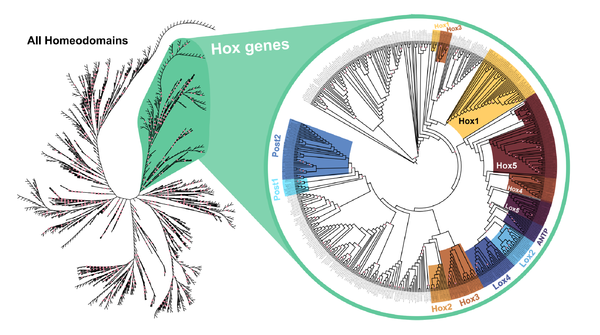

# Hox genes inference

## 1. Description 
Homeobox genes were inferred as previously described in **Zwarycz et al.** on the protein sequences of all species with chromosome-level genomes, plus the draft genome of *Enchytraeus crypticus*. To further identify Hox genes, phylogenetic trees were inferred with IQ-TREE 2.2.2.2 under the LG+F+R10 model as selected by ModelFinder. A second tree (model LG+F+R9) was inferred with the subset of putative Hox genes to classify each sequence into its Hox subfamily. Hox clusters were defined using the genomic coordinates of the putative Hox genes.

## 2. Files in this repository
  - **Hox genes phylogenies**  
    - All **homedomains** phylogenetic tree:
      - **All_HDomain_Cg.fasta**: Input sequences
      - **All_HDomain_Cg.fasta.log**: IQ-TREE log file
      - **All_HDomain_Cg.fasta.contree**: IQ-TREE consensus tree file
      - **All_HDomain_Cg.fasta.treefile**: IQ-TREE phylogenetic tree (newick)
      - **All_HDomain_Cg.fasta.iqtree**: IQ-TREE iqtree file  
    - **Hox genes** phylogenetic tree:
      - **All_HDomain_Cg_Hox.txt**: Names of input sequences
      - **All_HDomain_Cg_Hox.fasta**: Input sequences
      - **All_HDomain_Cg_Hox.fasta.log**: IQ-TREE log file
      - **All_HDomain_Cg_Hox.fasta.contree**: IQ-TREE consensus tree file
      - **All_HDomain_Cg_Hox.fasta.treefile**: IQ-TREE phylogenetic tree (newick)
      - **All_HDomain_Cg_Hox.fasta.iqtree**: IQ-TREE iqtree file
