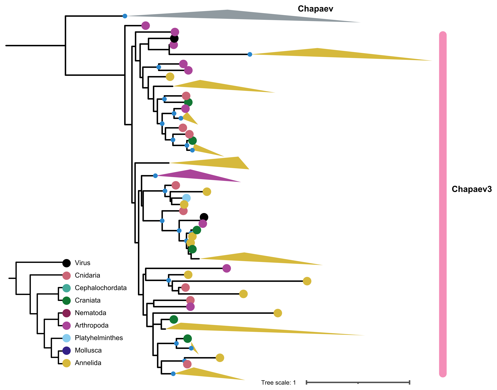

# Transposable elements, satellite DNA and centromere identification

## 1. Description
Transposable elements (TEs) were de novo identified within each of the available genome assemblies using RepeatModeler and the obtained library was used to mask the corresponding genome. The putative centromeres were identified with the **findTEsinCentromeres.R** script. Briefly, each genome was divided into bins of 50 kb. The fraction of bases covered by TEs was calculated for each bin. These values were smoothed using the mean value of the 50 bins surrounding each bin. Next, the 10% of the bins with the highest coverage were identified and joined when the adjacent ones. Finally, merged bins longer than 1 Mb were selected as the putative centromeres. To identify tandem repeats and satellite DNA, Spectral Repeat Finder (SRF) was used. The density throughout the genome was plotted using custom R scripts available at the GitHub repository associated with this manuscript. 

## 2. Files in this repository
  - **chromSizes.RData**: Object containing the sizes of the chromosomes (or scaffolds) in each species.
  - **Superfamilies_RModeler.RData**: Not provided here given the large size of the TE annotation files.
  - **findTEsindCentromeres.R**: Script to identify the putative centromeres.
  - **plotTRs.R**: Script to plot the tandem repeats using the output of SRF.
